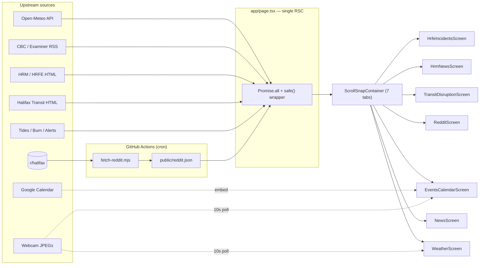

# Halifax Civic Dashboard

A read-only public dashboard for Halifax, Nova Scotia residents.
Live at: https://halifax-civic-dashboard.vercel.app/

---

## Part 1 — For users

### What it does

Aggregates real-time local information into a single swipeable view (7 tabs):

| Tab | Contents |
|---|---|
| **City Live** | Weather + 5-day forecast, air quality, tides, burn status, active alerts, live webcams (Halifax Harbour Bridges, Emera Oval area) |
| **News** | Local news from CBC Nova Scotia and Halifax Examiner (past 24h) |
| **Reddit** | Top hot posts from r/halifax (refreshed every ~15 min via scheduled job) |
| **Transit** | Halifax Transit active detours, ferry alerts, route adjustments |
| **HRM** | Municipal announcements from Halifax Regional Municipality |
| **HRFE** | Halifax Regional Fire & Emergency live incident feed (past 6h) |
| **Events** | Upcoming civic events (HRM Events Calendar) + Emera Oval webcam |

### Why it exists

A non-commercial side project that surfaces official civic data + community
discussion in one place, so Halifax residents don't have to bounce across
six websites to know what's happening today.

### Privacy

- No user accounts, no tracking beyond Vercel's anonymous analytics.
- No Reddit data stored beyond a short server-side cache.
- All data sources are public RSS / HTML / open APIs.

### Install

Works in any browser. On mobile, "Add to Home Screen" gives a PWA-style
launch experience (manifest + offline shell via service worker).

---

## Part 2 — For developers

### Tech stack

- **Next.js 16** (App Router, React Server Components)
- **React 19** · **TypeScript 5** · **Tailwind CSS 4**
- `rss-parser` · `node-html-parser` · `hls.js` · `next-themes`
- Deployed on **Vercel**, scheduled jobs via **GitHub Actions**

### Rendering model



The root page fetches everything server-side in parallel. Every fetcher
returns an "empty" sentinel on failure, and `safe()` ([lib/safe.ts](lib/safe.ts))
catches anything that still escapes — one broken upstream source can't 500
the dashboard.

### Data sources

| Source | Method | Where |
|---|---|---|
| Open-Meteo (weather, air quality) | Public API | [lib/fetchers/weather.ts](lib/fetchers/weather.ts), [air-quality.ts](lib/fetchers/air-quality.ts) |
| CBC NS + Halifax Examiner | RSS | [lib/fetchers/news.ts](lib/fetchers/news.ts) |
| HRM News, HRFE Incidents | HTML scrape | [lib/fetchers/hrm.ts](lib/fetchers/hrm.ts) |
| Halifax Transit detours/ferry | HTML scrape | [lib/fetchers/transit.ts](lib/fetchers/transit.ts) |
| Tides, Burn status, Alerts | Public sources | [lib/fetchers/](lib/fetchers/) |
| **r/halifax** | **GitHub Actions cron → `public/reddit.json`** | [scripts/fetch-reddit.mjs](scripts/fetch-reddit.mjs) + [.github/workflows/fetch-reddit.yml](.github/workflows/fetch-reddit.yml) |
| HRM Events Calendar | Google Calendar embed | [EventsCalendarScreen](components/screens/EventsCalendarScreen.tsx) |

**Why Reddit goes through GitHub Actions instead of a runtime fetch:**
Reddit aggressively blocks data-center IPs (including Vercel's). A scheduled
GitHub Actions job pulls the data with rotating UAs and commits the result
to `public/reddit.json`. The app reads it as a static asset — zero risk of
Reddit blocking production users, and the dashboard always has the last
known good data even if the job fails.

### Client-side dynamic pieces

- **Webcams** — [HalifaxWebcams](components/HalifaxWebcams.tsx) and
  [EmeraOvalWebcam](components/EmeraOvalWebcam.tsx) poll JPEG stills every
  10 s via [usePolledImage](components/usePolledImage.ts). Polling pauses
  when the tab is backgrounded.
- **RefreshOnVisible** — re-fetches RSC data when the tab returns to the
  foreground.
- **LiveClock**, **WeatherPills**, **HapticTab** — small interactive bits.

### Supporting infrastructure

- **Same-origin image proxy** [app/api/img/route.ts](app/api/img/route.ts) —
  some upstream CDNs (notably `i.cbc.ca`) trigger Chrome's Opaque Response
  Blocking. The proxy re-emits bytes under our origin. Hostname allowlist
  prevents it from becoming an open proxy.
- **PWA** — [app/manifest.ts](app/manifest.ts) + [public/sw.js](public/sw.js)
  + [InstallButton](components/InstallButton.tsx).
- **i18n** — [GoogleTranslateMount](components/GoogleTranslateMount.tsx) +
  [LanguageToggle](components/LanguageToggle.tsx).
- **Theming** — `next-themes` + a weather-driven palette in
  [lib/weather-theme.ts](lib/weather-theme.ts).
- **Feedback** — [FeedbackModal](components/FeedbackModal.tsx).
- **Analytics** — `@vercel/analytics` (anonymous page views only).

### Project layout

```
app/
  page.tsx           # single RSC entry; fans out all fetchers
  layout.tsx
  manifest.ts        # PWA manifest
  api/img/           # same-origin image proxy (ORB workaround)
components/
  screens/           # one component per tab
  *.tsx              # shared widgets (clock, webcams, settings, ...)
lib/
  fetchers/          # one file per data source
  safe.ts            # fault-isolation wrapper used by page.tsx
  html.ts, date.ts, weather-theme.ts
scripts/
  fetch-reddit.mjs   # run by GitHub Actions
  generate-icons.mjs
.github/workflows/
  fetch-reddit.yml   # cron schedule for the Reddit pull
public/
  reddit.json        # committed output of the cron job
  sw.js, icons, logo
```

### Running locally

```bash
npm install
npm run dev          # http://localhost:3000
npm run build && npm start
npm run lint
```

No environment variables are required for the dashboard itself. The Reddit
fetch script runs entirely in CI and writes to a committed file, so local
dev reads whatever was last pulled.

### Iteration & deployment

- **Preview Deployments** — every PR / branch gets its own Vercel URL.
  Test on a real phone before merging to `main`.
- **Instant rollback** — Vercel keeps every deployment; one click reverts.
- **Fault isolation** — wrap every new tab's data in `safe()` so a broken
  upstream can't take the whole dashboard down. Consider adding a React
  Error Boundary around each screen for client-side failures.
- **New data sources** — prefer the "cron → static JSON in `public/`"
  pattern (as with Reddit) for any upstream that's flaky, rate-limited, or
  hostile to data-center IPs.

### Non-commercial

This project is non-commercial, open-source, and serves Halifax residents
only. No user data is collected. No Reddit data is stored beyond the
short-lived cache embedded in `public/reddit.json`.
