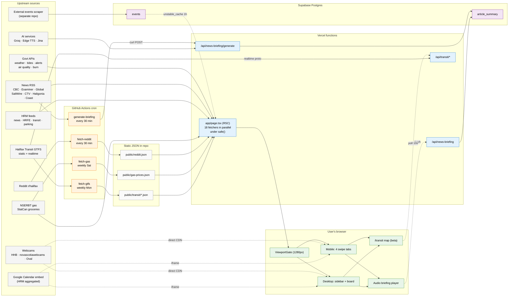

# Halifax Civic Dashboard

A read-only public dashboard for Halifax, Nova Scotia residents.
Live at: https://halifax-civic-dashboard.vercel.app/

---

## Part 1 — For users

### What it does

Aggregates real-time local information into a single swipeable view (7 tabs):

| Tab | Contents |
|---|---|
| **City Live** | Weather + 5-day forecast, air quality, tides, burn status, active alerts, live webcams (Halifax Harbour Bridges, Emera Oval area) |
| **News** | Local news from CBC Nova Scotia and Halifax Examiner (past 24h) |
| **Reddit** | Top hot posts from r/halifax (refreshed every ~15 min via scheduled job) |
| **Transit** | Halifax Transit active detours, ferry alerts, route adjustments |
| **HRM** | Municipal announcements from Halifax Regional Municipality |
| **HRFE** | Halifax Regional Fire & Emergency live incident feed (past 6h) |
| **Events** | Upcoming civic events (HRM Events Calendar) + Emera Oval webcam |

### Why it exists

A non-commercial side project that surfaces official civic data + community
discussion in one place, so Halifax residents don't have to bounce across
six websites to know what's happening today.

### Privacy

- No user accounts, no tracking beyond Vercel's anonymous analytics.
- No Reddit data stored beyond a short server-side cache.
- All data sources are public RSS / HTML / open APIs.

### Install

Works in any browser. On mobile, "Add to Home Screen" gives a PWA-style
launch experience (manifest + offline shell via service worker).

---

## Part 2 — For developers

### Tech stack

- **Next.js 16** (App Router, React Server Components)
- **React 19** · **TypeScript 5** · **Tailwind CSS 4**
- `rss-parser` · `node-html-parser` · `hls.js` · `next-themes`
- Deployed on **Vercel**, scheduled jobs via **GitHub Actions**

### Architecture at a glance

Everything in one diagram. Read it left-to-right: data sources on the
left, compute layers in the middle, what the user sees on the right.
Solid arrows are eager flow (cron tick / RSC request). Dotted arrows are
direct/lazy/cached connections that don't go through this app's server.



Three pieces of detail the diagram glosses over (each gets its own
subsection below):
- The **briefing cron** does more than the arrow suggests — it fetches
  each article's body, summarizes with Groq, synthesizes audio with Edge
  TTS, and writes everything to one row. Failures degrade gracefully.
- The **`events` table** is read on every dashboard load, but is wrapped
  in `unstable_cache` 1h — so dashboard loads almost never hit Postgres.
- The **/api/img** route (not pictured) is a same-origin image proxy
  that re-emits CBC's CDN bytes under this app's origin, to work around
  Chrome's Opaque Response Blocking on `i.cbc.ca`.

#### All cron jobs

| Workflow | Schedule (UTC) | What it does | Output |
|---|---|---|---|
| [fetch-reddit](.github/workflows/fetch-reddit.yml) | `*/30 * * * *` (every 30 min) | [scripts/fetch-reddit.mjs](scripts/fetch-reddit.mjs) — 8 fallback strategies (JSON/HTML/RSS × 3 UAs) because Reddit hard-blocks data-center IPs | commits `public/reddit.json` |
| [generate-briefing](.github/workflows/generate-briefing.yml) | `*/30 * * * *` (every 30 min) | `curl POST /api/news-briefing/generate` → fetch article body → Groq summarize → Edge TTS → write Supabase row | rows in `article_summary` |
| [fetch-gas-prices](.github/workflows/fetch-gas-prices.yml) | `0 19 * * 6` (Sat 15:00 ADT) | [scripts/fetch-gas-prices.mjs](scripts/fetch-gas-prices.mjs) — scrape NSERBT Zone 1 weekly prices, append to history | commits `public/gas-prices.json` |
| [fetch-gtfs](.github/workflows/fetch-gtfs.yml) | `0 6 * * 1` (Mon 06:00 UTC) | [scripts/fetch-gtfs.mjs](scripts/fetch-gtfs.mjs) — download HRM GTFS zip; emit stops/routes/trips + polyline-encoded shapes | commits `public/transit/*.json` |
| [backfill-gas-prices](.github/workflows/backfill-gas-prices.yml) | manual only | [scripts/backfill-gas-prices.mjs](scripts/backfill-gas-prices.mjs) — `pdftotext` historical NSERBT PDFs for seed data | commits `public/gas-prices.json` |

Both 30-min crons fire on the same wall-clock minute; concurrency groups are
separate, no collision. None of the crons trigger a Vercel deployment — they
only hit existing functions or push commits.

#### All upstream sources

**▼ Pulled on every dashboard request** (18 fetchers in parallel, each wrapped in `safe()`)

| Source | URL | Where |
|---|---|---|
| ECCC weather + 5-day forecast | api.weather.gc.ca | [weather.ts](lib/fetchers/weather.ts) |
| ECCC marine forecast | api.weather.gc.ca | [marine-forecast.ts](lib/fetchers/marine-forecast.ts) |
| ECCC weather alerts (RSS) | weather.gc.ca/rss | [alerts.ts](lib/fetchers/alerts.ts) |
| Open-Meteo air quality | air-quality-api.open-meteo.com | [air-quality.ts](lib/fetchers/air-quality.ts) |
| DFO tides | api-iwls.dfo-mpo.gc.ca | [tides.ts](lib/fetchers/tides.ts) |
| SmartAtlantic Halifax buoy | smartatlantic.ca/erddap | [buoy.ts](lib/fetchers/buoy.ts) |
| NS burn-safe status (HTML) | novascotia.ca/burnsafe | [burn-status.ts](lib/fetchers/burn-status.ts) |
| CBC NS / Halifax Examiner / Global News / SaltWire / CTV / Haligonia / The Coast | various RSS | [news.ts](lib/fetchers/news.ts) |
| HRM News RSS | halifax.ca/news/rss-feed | [hrm.ts](lib/fetchers/hrm.ts) |
| HRFE Incidents RSS | halifax.ca/.../hrfe-incident-feed/rss.xml | [hrm.ts](lib/fetchers/hrm.ts) |
| HRM transit detours + adjustments (HTML scrape) | halifax.ca/transportation/… | [transit.ts](lib/fetchers/transit.ts) |
| HRM winter parking ban (RSS category 22) | halifax.ca/news/category/rss-feed | [winter-parking.ts](lib/fetchers/winter-parking.ts) |
| Statistics Canada grocery prices (CSV in ZIP) | www150.statcan.gc.ca | [grocery.ts](lib/fetchers/grocery.ts) |
| Curated Halifax events | reads from Supabase `events` table (external scraper writes; 1h `unstable_cache` layer) | [events.ts](lib/fetchers/events.ts) |

**▼ Cached via CI cron → committed JSON in `public/`**

| Source | Refresh | File |
|---|---|---|
| r/halifax hot posts | every 30 min | `public/reddit.json` |
| NSERBT Zone 1 gas prices | Saturdays | `public/gas-prices.json` |
| Halifax Transit GTFS static (stops/routes/trips/shapes) | Mondays | `public/transit/*.json` |

**▼ Hit directly from the user's browser**

| Source | Cadence |
|---|---|
| Halifax Harbour Bridges traffic cam PNGs | 10s polled, paused when tab hidden |
| novascotiawebcams HLS streams | live video |
| Emera Oval still | 10s polled |
| Halifax Transit GTFS-RT vehicles + arrivals | via `/api/transit/*`, ~10s polled |
| Windy map iframe | lazy-loaded on scroll |
| Google Calendar embed (HRM raw municipal + community feeds, 16 calendars stacked) | iframe in City Live tab |
| Google Translate widget | injected on language toggle |

**▼ Used only by the briefing pipeline** (cron → `/api/news-briefing/generate`)

| Service | Purpose | Auth |
|---|---|---|
| Direct HTTP scrape (JSON-LD + `<p>`) | tier 1+2 article-body extractor | none |
| Jina Reader (r.jina.ai) | tier 3 fallback for JS-rendered / IP-blocked sites | optional `JINA_API_KEY` |
| Groq Llama 3.3 70B (api.groq.com) | article summarization | `GROQ_API_KEY` |
| Microsoft Edge Read Aloud (speech.platform.bing.com WSS) | TTS, via `msedge-tts` package | none |
| Supabase Postgres (transaction pooler :6543) | summary + audio storage | `SUPABASE_DB_URL` |

#### News briefing pipeline (AI summary + TTS audio)

The "Listen to briefing" button on the News tab plays a 2-3 sentence AI
summary of each fresh local-news article, voiced by Microsoft Edge's neural
TTS. This is the most complex moving piece in the project — five services
chained together, with caching at the URL level so each article is
processed exactly once.

```
[news.ts fetchNews]                        same RSS list the News tab shows
        │
        ▼
[SELECT url FROM article_summary]          which of these are new?
        │
        ▼
[enrichWithArticleText]                    3-tier scrape:
        │                                  JSON-LD → <p> tags → Jina Reader
        ▼
[summarizeArticle → Groq Llama 3.3 70B]    "2-3 sentence spoken blurb"
        │
        ▼
[synthesizeSpeech → msedge-tts WSS]        voice: en-US-AndrewMultilingualNeural
        │                                  → MP3 buffer
        ▼
[INSERT article_summary
  (url, title, source, summary,            audio_b64 is base64-encoded MP3
   audio_b64, pub_date)]
        │
        ▼
   waits in Supabase  ──► user clicks Listen
                          GET /api/news-briefing
                          rows returned with
                          audio: data:audio/mp3;base64,…
                          browser plays <audio src=data:…>
```

**Schema** ([app/api/news-briefing/generate/route.ts](app/api/news-briefing/generate/route.ts)):

```sql
article_summary (
  url         text PRIMARY KEY,   -- dedup key
  title       text,
  source      text,
  summary     text,                -- AI-generated 2-3 sentences
  audio_b64   text,                -- base64-encoded MP3 bytes
  pub_date    timestamptz,
  created_at  timestamptz DEFAULT now()
)
```

**Key behaviors:**

- **Per-URL dedup** — once an article is processed, it's never re-summarized.
  Old rows are deleted after 48h ([retention](app/api/news-briefing/generate/route.ts:26)),
  which is the only way an article can re-enter the pipeline.
- **Per-run cap** — at most 8 new articles per cron tick, with 4-wide
  summarize/TTS concurrency. A cold-started DB takes 3–4 ticks to backfill.
- **Audio lives in Postgres** as base64 — works because clips are short
  (2-3 sentences ≈ ~200 KB MP3 ≈ ~270 KB base64), and the 48h retention
  keeps the table bounded. The browser reads them as `data:audio/mp3;base64,…`
  URLs straight off the `<audio>` element. No S3, no signed URLs, no extra
  service to operate.
- **Degrades gracefully** — every step returns `null` on failure. Groq down
  → row stored with `summary = title`. TTS down → row stored with no audio
  (Listen button skips it). Scrape fails → only the RSS snippet feeds the
  LLM. The user always sees text, even when half the pipeline is broken.

**Required env vars:**

| Name | Where | Purpose |
|---|---|---|
| `GROQ_API_KEY` | Vercel | Groq summarization (free tier ~1k req/day) |
| `SUPABASE_DB_URL` | Vercel | Postgres connection (transaction pooler :6543) |
| `CRON_SECRET` (optional) | Vercel + GitHub secrets | If set on Vercel, `/generate` requires `Authorization: Bearer ${CRON_SECRET}` |
| `BRIEFING_BASE_URL` | GitHub Actions secrets | The deployed origin curl targets, e.g. `https://dash.halifaxtalk.cc` |
| `JINA_API_KEY` (optional) | Vercel | Higher r.jina.ai rate limit when tier-3 fallback is hit often |

**No env vars needed for TTS** — `msedge-tts` reverse-engineers Edge
browser's Read Aloud WebSocket endpoint (Azure Neural Voice underneath).
Stable for years; if Microsoft ever changes the endpoint, `synthesizeSpeech()`
returns `null` and the pipeline falls back to text-only briefings.

#### Events pipeline (curated calendar + raw Google Calendar iframe)

There are **two unrelated event surfaces** in the app, serving two different
needs:

1. **Events tab** — a structured, filterable list of curated upcoming
   Halifax-area events. Reads from the Supabase `events` table, populated
   by an **external scraper that lives in a separate repo** (not in this
   project). Each row is a rich record with venue, organizer, price,
   tickets URL, social links, etc.
2. **HRM Events card** inside the City Live tab — an embedded Google
   Calendar iframe showing the raw, unfiltered municipal + community
   calendars HRM publishes. **Sixteen** separate Google Calendar feed IDs
   are stacked into one embed URL ([lib/data/hrm-calendar.ts](lib/data/hrm-calendar.ts));
   the iframe is loaded by the browser straight from `calendar.google.com`,
   no server involvement.

Only the curated path (#1) flows through this app's backend. End-to-end:

```
[external scraper, separate repo]
        │ scrapes Halifax-area event sources, daily-ish
        ▼
[Supabase events table]                            persistent source of truth
        │
        ▼
[fetchEvents() RSC + unstable_cache]               revalidate: 3600 (1 hour)
        │                                          most page loads hit memory,
        ▼                                          not Supabase
[WHERE: upcoming or still-running,
        Halifax-tz date math for all-day events]
        │
        ▼
[Page renders → EventsCalendarScreen → EventsFeed] client filters by date /
                                                   category, renders cards
```

**Schema** ([lib/fetchers/events.ts](lib/fetchers/events.ts)):

```sql
events (
  url             text PRIMARY KEY,    -- canonical event URL, dedup key
  title           text,
  summary         text,                 -- short blurb shown under title
  start_at        timestamptz,
  end_at          timestamptz,          -- nullable; all-day events store
                                        --   end_at = start_at at local midnight
  date_text       text,                 -- human-readable "Jun 5" or
                                        --   "Dec 31, 2025 - Dec 31, 2027"
  time_text       text,                 -- human "7:00 PM" or "All Day"
  price_range     text,                 -- "Free", "$15-30", etc.
  categories      text[],               -- e.g. {"Music","Free","Family-Friendly"}
  venue_name      text,
  venue_address   text,
  organizer_name  text,
  website         text,
  tickets_url     text,
  facebook_url    text,
  instagram_url   text,
  twitter_url     text
)
```

**Server-side query** ([events.ts:28-53](lib/fetchers/events.ts:28)) keeps only
events that are still relevant:

- All-day events (`end_at = start_at`) — visible while their Halifax-local
  calendar date is today or later (a `WHERE end_at > now()` would drop them
  at 00:00 of their own day).
- Timed events with an `end_at` — visible while `end_at > now()`.
- Events with no `end_at` — visible until 2 days after `start_at`.

Sorted ascending by `start_at`. Client-side ([EventsFeed.tsx](components/EventsFeed.tsx))
then re-orders so single-day events come first; long multi-day runs
(exhibits, festivals) sink to the bottom so they don't bury what's
happening today.

**Key behaviors:**

- **`unstable_cache` 3600s wrapper** ([events.ts:57](lib/fetchers/events.ts:57))
  — the dashboard does NOT hit Supabase on every page load. The cache key
  is `['halifax-events']`; on cache miss, one DB query runs; everything
  else inside the hour serves from in-memory cache. So an event added by
  the scraper at 10:05 may not appear in the dashboard until ~11:05
  (next cache rebuild).
- **No write path lives in this repo** — the scraper is external; if it
  stops running, the dashboard keeps showing whatever rows are in
  Supabase, with old ones falling out naturally as their `end_at` /
  `start_at + 2 days` window expires.
- **Frontend filter state is local** — date filter (`Today` / `Next 3 days`
  / `All`) and category pills are React state in `EventsFeed`, never sent
  to the server. The full result set ships once; filtering is instant.
- **Venue tap-to-Map** — `venue_name` + `venue_address` are encoded into a
  Google Maps universal URL (`google.com/maps/search/?api=1&query=…`)
  that opens the native Maps app on phones, Maps web on desktop.

**Required env vars:** none beyond `SUPABASE_DB_URL` (shared with the
briefing pipeline).

#### What runs where

| Runtime | Code path | Trigger |
|---|---|---|
| User's browser | every `"use client"` component, the pre-paint viewport `<script>` in [app/layout.tsx](app/layout.tsx), HLS player, polled image loop, `<audio>` element, transit map | on open / on interaction |
| Vercel function (RSC) | [app/page.tsx](app/page.tsx) + every `lib/fetchers/*.ts` — 18 fetchers wrapped in `Promise.all([safe(…)])` | every dashboard load |
| Vercel function (API) | the 5 routes under `app/api/` | on demand (browser or cron) |
| GitHub Actions runner | the 5 workflows | cron schedule (or manual `workflow_dispatch`) |
| Supabase Postgres | `article_summary` table | written by `generate-briefing` cron, read by dashboard |

#### User actions and their server impact

| User action | Frontend behavior | Server hit |
|---|---|---|
| Open `dash.halifaxtalk.cc` | one HTML response, all sections pre-rendered | 1 RSC invocation; 18 parallel upstream fetches; ~1-3s cold |
| Click a cam pill | switch active cam in React state | none — bytes go upstream CDN → browser |
| Click "Listen to briefing" | `fetch /api/news-briefing` → play base64 MP3 data URL | 1 Vercel function + 1 Supabase SELECT |
| Click "Read" (beta) | `fetch /api/news-briefing?mode=text` (audio bytes omitted) | 1 Vercel function + 1 Supabase SELECT |
| Swipe tab / click sidebar | scroll to section or swap board panel | none |
| Save waste-collection prefs | localStorage write | none |
| Open `/transit` (beta) | client polls `/api/transit/{vehicles,arrivals}` ~10s | 2 function calls per poll → GTFS-RT proto fetch upstream |
| Toggle theme | `next-themes` localStorage | none |
| Translate language | injects Google Translate widget | external Google call (no key) |
| Install PWA | manifest + [public/sw.js](public/sw.js) | none |

#### Mobile / desktop split

[ViewportGate](components/ViewportGate.tsx) chooses one of two trees at 1280px:

- **Below 1280px** — `ScrollSnapContainer` with 4 swipeable tabs: City Live, Pulse, Events, Stats.
- **At/above 1280px** — `DesktopShell` sidebar nav + a multi-column dashboard. Two purpose-built boards ([CityLiveBoard](components/desktop/CityLiveBoard.tsx), [PulseBoard](components/desktop/PulseBoard.tsx)) for the high-density panels; Events and Stats reuse the mobile screens as detail panes.

Both trees consume the **same `DashboardData` object** fetched once by `app/page.tsx`, so the desktop view never triggers an extra request.

#### Safety net

Every server fetcher is wrapped in [`safe()`](lib/safe.ts) which returns a
fallback on throw. Combined with the per-fetcher try/catch inside each
`lib/fetchers/*.ts`, one upstream going down can never 500 the page — the
affected block just renders empty. CI scripts that fail exit non-zero, so
GitHub marks a red ❌ but the existing committed JSON stays in place (next
request still serves last-good data). The briefing cron uses
[`generate-briefing.yml`](.github/workflows/generate-briefing.yml)'s grep on
`"ok":true` so a silent no-op also flips the run red.

### Project layout

```
app/
  page.tsx           # single RSC entry; fans out all fetchers
  layout.tsx
  manifest.ts        # PWA manifest
  api/img/           # same-origin image proxy (ORB workaround)
components/
  screens/           # one component per tab
  *.tsx              # shared widgets (clock, webcams, settings, ...)
lib/
  fetchers/          # one file per data source
  safe.ts            # fault-isolation wrapper used by page.tsx
  html.ts, date.ts, weather-theme.ts
scripts/
  fetch-reddit.mjs   # run by GitHub Actions
  generate-icons.mjs
.github/workflows/
  fetch-reddit.yml   # cron schedule for the Reddit pull
public/
  reddit.json        # committed output of the cron job
  sw.js, icons, logo
```

### Running locally

```bash
npm install
npm run dev          # http://localhost:3000
npm run build && npm start
npm run lint
```

No environment variables are required for the dashboard itself. The Reddit
fetch script runs entirely in CI and writes to a committed file, so local
dev reads whatever was last pulled.

### Iteration & deployment

- **Preview Deployments** — every PR / branch gets its own Vercel URL.
  Test on a real phone before merging to `main`.
- **Instant rollback** — Vercel keeps every deployment; one click reverts.
- **Fault isolation** — wrap every new tab's data in `safe()` so a broken
  upstream can't take the whole dashboard down. Consider adding a React
  Error Boundary around each screen for client-side failures.
- **New data sources** — prefer the "cron → static JSON in `public/`"
  pattern (as with Reddit) for any upstream that's flaky, rate-limited, or
  hostile to data-center IPs.

### Non-commercial

This project is non-commercial, open-source, and serves Halifax residents
only. No user data is collected. No Reddit data is stored beyond the
short-lived cache embedded in `public/reddit.json`.
